# MINI COMMANDOES — Blueprint (master architecture source)

> Status key used everywhere: **Planned → In progress → Implemented → Build verified → Runtime verified → Device verified → Network verified → Production ready**.
> Nothing below is "done" unless `PROJECT.md` says so with evidence. Architecture changes: update this file *first* (CLAUDE.md §Change protocol).

## 0. Decision records

| ID | Decision | Why | Rejected |
|---|---|---|---|
| D1 | **Godot 4.6.3 (pinned), GDScript, `gl_compatibility` renderer** | MIT, ~no fees; headless export in CI; best fit for 2D on low-end Android; no editor needed locally. 4.7.x exists but 4.6.3 is a mature maintenance line; bump deliberately later. | Unity (license activation in CI, heavier APK), Unreal (huge, wrong for 2D), native Kotlin+GL (too much tooling work for a phone-only owner) |
| D2 | Data-driven content in `data/*.json` | Editable on GitHub mobile; add a weapon/character/map without touching code | Hard-coded content, `.tres` only (not phone-editable) |
| D3 | Host-authoritative **listen server** over ENet (`ENetMultiplayerPeer`) | No cloud needed; one phone hosts; clients can't set their own HP/score | Peer-to-peer lockstep (cheat/desync risk at 40), cloud relay (not required for v1) |
| D4 | Original art as **layered SVG body parts + cut-out skeletal rig** authored in-repo (text files) | Phone/GitHub friendly, original, scalable, small APK, real head/torso/limbs/boots (not primitives) | Hand-drawn PNG sheets (cannot be produced from phone workflow), AI/stock sprites (licensing risk) |
| D5 | Own tiny headless test runner (`tests/run_tests.gd`) instead of GUT | Zero dependencies | GUT addon (revisit if tests outgrow runner) |
| D6 | **Custom kinematic movement over a tile-grid collision map**, not `CharacterBody2D` | Deterministic → client prediction + reconciliation; cheap enough for 40 actors on a phone host | Godot physics bodies (non-deterministic across devices, costly ×40) |
| D7 | Audio generated procedurally by `tools/gen_audio.py` (stdlib only); **outputs are committed** (deterministic, reproducible) instead of generated in CI | Original, no licensing, keeps repo small | Downloaded packs (license review per file), recorded audio (not possible on this workflow) |
| D9 | Code uses `preload("res://…")` constants and path-based `extends`, **no `class_name`** | avoids dependence on the global class cache during import/export | `class_name` everywhere |
| D10 | `window/handheld/orientation=4` (sensor landscape). Value 6 = any orientation (this caused BUG-001) | landscape-only game | — |
| D11 | **Equal base stats**: HP 200, EP 100 for all characters; characters identity-only | fair multiplayer, player freedom (owner design update) | per-character HP/skills/pets (previous design, removed) |
| D12 | Combat rules verified through a **Python reference model + hand-checked test vectors** replayed by GDScript tests | authoring sandbox cannot run Godot | trusting untested GDScript |
| D13 | HUD layout + haptics in a separate `controls.json` (schema 1), gameplay in `profile.json` (schema 2) | different lifecycles, device-specific | one big save |
| D14 | Haptics = (duration, amplitude) through `Input.vibrate_handheld`; presets differ in both because amplitude support is hardware-dependent | honest about Android limits | claiming fine intensity control |
| D15 | Character art = 2D cut-out sprites **baked from the owner's Meshy 3D model** (`tools/bake_sprites.py`, docs/art_pipeline.md); the FBX is not shipped or committed | game is 2D; model is a 1.4M-tri static mesh | shipping the 3D mesh, hand-drawn SVG rigs (D4, superseded for the commando) |
| D16 | Movement is a deterministic kinematic sim over a tile grid (`src/player/move_sim.gd`), verified through the Python reference + vectors like combat | netcode needs determinism (D6) | Godot physics bodies |
| D8 | Android first: arm64-v8a, APK for sideload, AAB later for Play | Phone owner sideloads; Play needs AAB + Gradle template | armv7 (adds size; revisit if low-end test devices need it) |

**Known risks (tracked, not hidden):** R1 40 players on a *phone host* may exceed CPU/radio budget → measured in stress test; fallback = lower cap per device class, bots count as players. R2 Export option names in `export_presets.cfg` are UNVERIFIED until first CI export. R3 Android UDP broadcast discovery is device-dependent (multicast lock, client isolation) → **manual IP join is the guaranteed path**. R4 Procedural audio/music quality needs human listening review.

## 1. Product overview

Original 2D multiplayer commando shooter. Fast movement, jetpack air combat, guns + full melee, grenades, loot/backpack, per-character skills and pets, large vertical maps, up to 40 players, LAN/hotspot play with bots, Android first.

| Pillar | Meaning |
|---|---|
| Fluid movement | Jetpack + ground + melee momentum feel good before anything else |
| Always able to fight | No gun ≠ helpless: melee is a full system |
| Loot decisions | Rarity, weight, backpack slots create choices |
| Distinct commandos | 4 characters × (1 active + 4 passive + 1 pet skill) change how you play |
| Plays offline | No internet needed: hotspot/LAN + bots |

Originality rule: genre inspiration only; no copied code, sprites, maps, names, UI, sounds.

## 2. Core gameplay loop

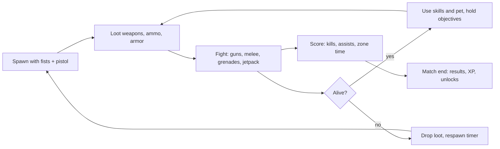

## 3. Game architecture (layers)

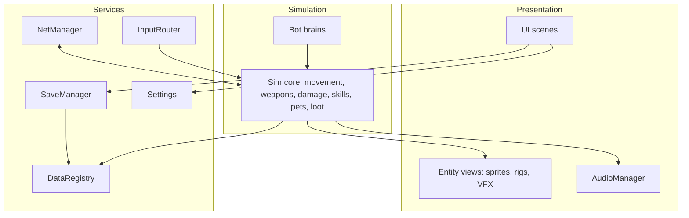

Rules: simulation code never touches UI nodes; presentation reads sim state. Sim classes are `RefCounted`/plain scripts where practical → unit-testable headless.

## 4. Folder structure

```
mini-commandoes/
├─ project.godot  export_presets.cfg  icon.svg
├─ blueprint.md CLAUDE.md handover.md TEST_PLAN.md ASSET_SOURCES.md PROJECT.md README.md
├─ data/                 # JSON content: characters skills pets weapons throwables loot modes maps (+ maps/*.txt later)
├─ scenes/               # boot/ menu/ match/ lobby/ hud/ entities/ ui_components/
├─ src/
│  ├─ core/              # version, ids, math utils, constants, enums
│  ├─ autoload/          # DataRegistry, GameState, Settings, SaveManager, AudioManager, InputRouter, SceneRouter
│  ├─ player/            # Commando sim+view, Movement, Jetpack, Melee, Health, Loadout, SkillRunner
│  ├─ combat/            # Weapon, Projectile, Grenade, Explosion, Damage, StatusEffect
│  ├─ ai/                # BotBrain, BotPerception, BotNav, difficulty profiles
│  ├─ net/               # NetManager, Discovery, Protocol, Snapshot, Prediction, Interest
│  ├─ maps/              # MapLoader, TileGrid, SpawnSystem, LootSpawner, Zones
│  ├─ ui/                # Theme, components, screens, VirtualControls
│  └─ audio/             # bus layout, sfx banks, music director
├─ assets/               # art/ (SVG parts, rigs), audio/ (generated), fonts/ (OFL only)
├─ tests/                # run_tests.gd + test_*.gd
├─ tools/                # validate_repo.py stamp_version.py gen_audio.py gen_art_check.py sim_stress.gd
├─ docs/                 # per-subsystem docs (see §46 in prompt; created with each subsystem)
└─ .github/workflows/    # ci.yml (now), release.yml, stress.yml (planned)
```

## 5. Scene structure

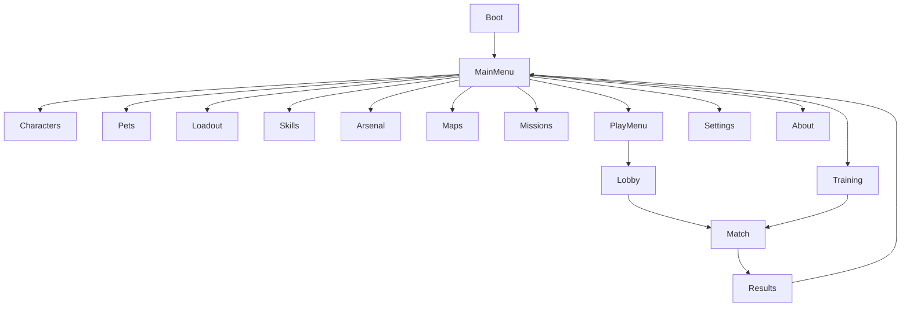

`Match` scene: `World` (TileGrid view, parallax, decor) → `Entities` (commandos, pets, pickups, projectiles) → `VFX` (pooled) → `HUD` (CanvasLayer) → `Controls` (CanvasLayer). Cameras: one `Camera2D` following the local commando with look-ahead toward aim.

## 6. Code architecture

Autoloads (all small, single-purpose): `Version`, `DataRegistry`, `Settings`, `SaveManager`, `AudioManager`, `InputRouter`, `SceneRouter`, `GameState`, `NetManager`.

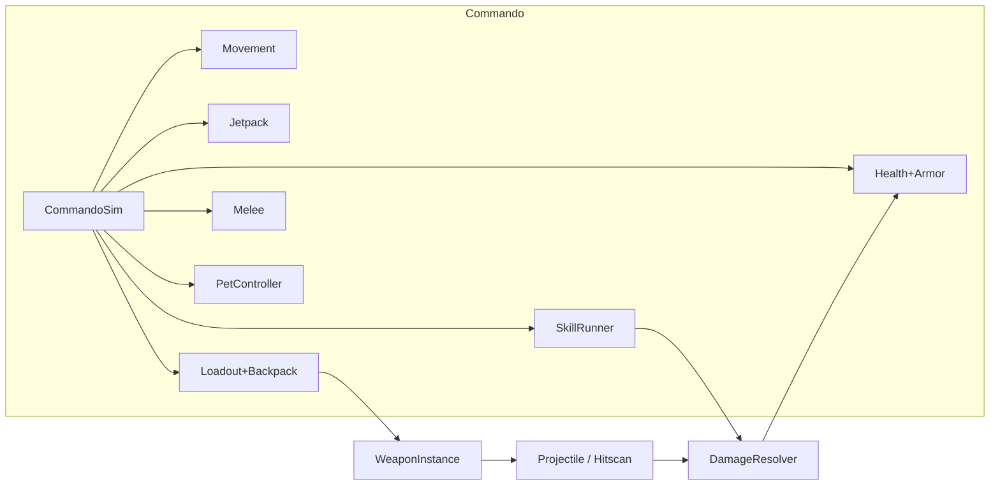

- **Commando** = `CommandoSim` (pure state, steps at fixed tick) + `CommandoView` (rig + animation). Same sim runs for human, bot, remote (host).
- **Fixed tick:** sim 60 Hz, network input 30 Hz, snapshots 20 Hz.
- **Events** via a simple signal bus `SimEvents` (kill, hit, pickup, skill_used) consumed by HUD/audio/VFX.
- Content ids are strings from `data/`; no content constants in code.

## 7. Character system
**Design correction (see PROJECT.md change log):** characters are **identity-only**. Every commando has the same base HP (200) and EP (100); there are no per-character stat multipliers, skills or pets. Characters differ by name, personality, appearance/palette, role flavor label and a *suggested* preset. Gameplay differences come only from the player's loadout (section 9, 10, 40).
Rig (art, later phase): `Skeleton` of `Node2D` joints with `Sprite2D` parts (head+face, helmet/hair, torso+vest, arms, hands, legs, boots, backpack, weapon mount), palette per character, clips generated from `data/anims/*.json`. Helmet and vest levels are visible on the rig (damage feedback).
Roster v1 (`characters.json`): **Rook Calloway** (Breacher), **Juno Vega** (Skirmisher), **Mirelle Okoye** (Mender), **Kade Rusk** (Overwatch). Role labels are flavor, not stats. Acceptance needs >= 2; target 4.
Animation state list (idle, run, jump/fall, jetpack, crouch, aim/shoot, reload, hurt, death, revive, skill, pet, pickup/swap, melee set) is unchanged.

## 8. Weapon system

12 launch weapons across rifle, SMG, shotgun, sniper, pistol, heavy, energy, experimental (see `weapons.json`). Every weapon has a distinct `special`. Hit models: `hitscan_tracer`, `hitscan_pierce`, `pellet`, `arc_shell`, `chain_beam`, `plasma_bolt`, `gravity_orb`. Rarity multiplies damage/magazine (see §17). Recoil and spread are per-weapon curves; ammo types: std, shell, heavy, explosive, cell. HUD: icon, ammo/mag, reload ring.

Hitscan is host-resolved (raycast vs. tile grid + player hit capsules, 150 ms lag-compensation window — planned, Phase 6).

## 9. Skill system
One shared pool (34 skills, `skills.json`): **8 active** (1 equip slot), **22 passive** (4 equip slots), **4 pet abilities** (come with the chosen pet). The player picks freely; legality is enforced by `LoadoutValidator` (budget 8, group limits, exclusions) and by global stat caps. Passives are **stat modifiers** (`{stat, op, value}`) resolved by `StatResolver` with caps; active/pet skills cost **EP** and have **cooldowns**; skills never edit damage code. Full rules: `docs/loadout.md`, `docs/combat.md`.
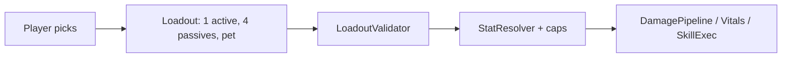
Skill status per entry: `pipeline` (simulated now), `pending_stat` (stat resolved, consumer arrives later), `behavior` (needs match sim; EP/cooldown already apply).

## 10. Pet system
Pets are **not locked to characters**: any character can use any pet (validated: only skill `excludes` rules apply, e.g. Pip + Spotter's Eye). The pet supplies one ability (`skills.json`, kind `pet`) with cooldown and EP cost. Pets are non-combatants (cannot be damaged or block shots) so netcode derives pet state from owner + skill timers. Pets: Bulwark (shield 40 HP/6 s), Pip (enemy mark), Biscuit (heal 45 HP/3 s), Talon (loot scout). Follow AI: ground/fly, follow distance from `pets.json`, smoothing, idle animation (Phase 4).

## 11. Loot system

Physical pickups (`Pickup` entity, pooled; items: weapons, ammo, throwables, bandage, health kit, EP cell, repair kit, helmet L1-3, vest L1-3, backpack upgrade, jet cell) from fixed map spawn points + death drops + air drops (extra X). Rarity table:

| Rarity | Weight | Color | Damage × | Mag × |
|---|---|---|---|---|
| Common | 55 | `#B8C0C8` | 1.00 | 1.00 |
| Uncommon | 25 | `#5BD66F` | 1.05 | 1.10 |
| Rare | 13 | `#4FA3FF` | 1.10 | 1.20 |
| Epic | 6 | `#B36BFF` | 1.15 | 1.30 |
| Legendary | 1 | `#FFB02E` | 1.20 | 1.40 |

Rarity is mechanical but capped (+20% dmg) to avoid snowballing. Spawner is host-only; respawn timers per point; high-rarity points sit in contested/vertical locations.

## 12. Backpack system

3 levels (data: `loot.json`): L1 4 slots, L2 7 slots, L3 10 slots. Slots hold spare weapons, throwables, medical/EP/repair items, jet cells (armor is worn, not carried). Ammo is carried per-type with caps scaled by level. Upgrade is a pickup. Death drops backpack contents (capped to avoid lag). UI: grid with drag-or-tap-to-use, auto-sort.

## 13. Health, EP, armor, damage pipeline
Authoritative description: **`docs/combat.md`**. Summary: Base HP 200 / Base EP 100 for everyone; helmet and vest are separate durable layers (levels 1-3) that never add HP; a temporary shield layer; an optional EP barrier passive; one fixed damage pipeline (hit location -> armor -> skill modifiers -> shield -> EP barrier -> HP -> death/knockdown) in `src/combat/damage_pipeline.gd` that is the only code allowed to change HP; HP and EP recovery are separate with item limits and a global heal cap. HUD: HP bar (green->red), EP bar (cyan), helmet/vest durability bars (steel blue), shield overlay, damage direction ticks.

## 14. Jetpack system

Fuel pool (default 100). Hold: thrust up with horizontal air control; tap-double: boost burst; release at apex: brief hover (limited, fuel drain). Fuel recharges while grounded (full in ~4 s) and slowly while falling. Overheat if drained to 0: 1.5 s lockout. Visual: flame + smoke particles (pooled, capped per profile); sound: loop with pitch tied to thrust. Damage taken while thrusting interrupts hover. Stat scalars per character (`jet_fuel`).

## 15. Melee system

| Move | Input | Notes |
|---|---|---|
| Light combo ×3 | tap melee | each hit chains within 0.45 s; 3rd has knockback |
| Heavy punch | hold melee | wind-up, armor-break bonus, longer recovery |
| Kick | melee + back/forward flick | mid-range, stagger |
| Uppercut / stomp | melee + up / down | air launcher / downward strike |
| Air melee | melee airborne | short dive strike |
| Dash attack (extra X) | melee during dash | later |

Frame data (startup/active/recovery), damage, knockback, hitstun live in `data/melee.json` (added in Phase 2). Melee is host-resolved with the same hitbox logic for bots. Melee must remain viable when ammo is out.

## 16. Grenade system

Seven throwables in `throwables.json`: Splinter Frag, Glare Flash, Veil Smoke, Static EMP, Limpet Charge, Mend Canister, Echo Decoy. Flow: pickup → aim arc preview → throw anim → custom kinematic bounce on tile grid → fuse → effect (damage / blind / smoke zone / disable jet+skills / sticky / heal field / decoy). Host-simulated; clients render + interpolate.

## 17. Map system

Authoring format (phone-editable): `data/maps/<id>.txt` ASCII tile grid (`#` solid, `=` one-way, `/` `\` 45° slopes, `.` empty, `~` hazard…) + `data/maps/<id>.json` for spawns, loot points, zones, decor, ambience. `MapLoader` builds `TileGrid` (collision, deterministic) and a `TileMap`/chunked view. Tile size 32 px; chunk 32×32 tiles; only visible chunks are drawn.

| Map | Theme | Size (px) | Milestone |
|---|---|---|---|
| Verdant Outpost | Jungle commando base | 9000×3200 | M1 |
| Ember Flats | Desert warzone | 10000×3000 | M1 |
| Foundry Nine | Industrial factory | 9000×3600 | M2 |
| Glacier Station | Frozen military facility | 9500×3400 | M2 |
| Hollow District | Urban ruins | 10000×3800 | M2 |

Each map: ≥3 elevation layers, tunnels, open zones, cover, vertical shafts, jetpack routes, hidden rooms, ≥24 loot points, ≥40 spawn points in team-balanced zones, environmental storytelling props. **Validation tool** (`tools/validate_maps.py`, Phase 5) checks reachability by walking+jetpack simulation: no unreachable loot/spawns, no spawn inside solids.

## 18. Spawn system

Spawn points tagged `team`, `zone`, `safety`. Choice = max over points of (distance to nearest enemy, line-of-sight penalty, recent-spawn penalty), then 2 s spawn shield. FFA uses global scoring; TDM prefers own-team zones. Host decides; clients only receive the result.

## 19. Multiplayer synchronization

Authority: host owns match state, projectiles, damage, pickups, skills, pets, score. Clients send **inputs**, not positions.

| Channel | Mode | Content | Rate |
|---|---|---|---|
| 0 | unreliable-sequenced | client input cmd (tick, buttons, move axis, aim angle) | 30 Hz |
| 1 | unreliable-sequenced | host snapshot (quantized states, delta vs last ack) | 20 Hz |
| 2 | reliable | events: spawn/kill/pickup/skill/chat/match state | on change |

Snapshot entity record ≈ 16 B: id, x,y (int16), vel (2×int8 scaled), aim (uint8), state flags (uint16), hp, armor, weapon, anim.
**Bandwidth budget (ESTIMATE, to be measured):** 40 × 16 B ≈ 650 B/snapshot × 20 Hz ≈ 13 KB/s per client (full); with area-of-interest (≈2.5 screen radius) ≈ 6–7 KB/s. Host upload for 39 clients ≈ 250–500 KB/s ≈ 2–4 Mbps.
Client: prediction + reconciliation for local commando; remote interpolation with 100 ms buffer; extrapolation capped at 150 ms.

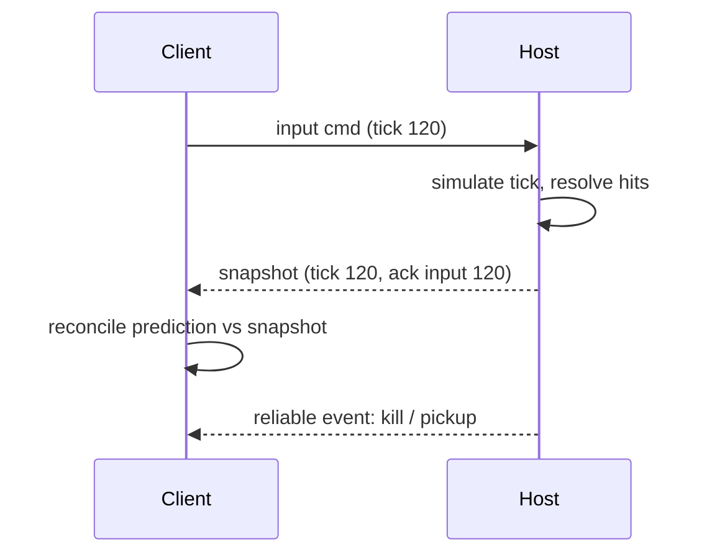

Anti-cheat v1 (offline LAN): host validates every input (speed, fire rate, cooldowns, ammo); client never sets HP/ammo/score. Not "unhackable"; sufficient for friends-on-hotspot.

## 20. Lobby system

States: `IDLE → HOSTING_LOBBY → STARTING → IN_MATCH → ENDED`. Lobby shows: room name, map, mode, bot count/difficulty, player slots (2–40), team assignment (auto-balance + manual swap by host), ready flags, host IP:port (always shown, copyable), start button (host only), kick (host only).

## 21. LAN discovery

Host broadcasts a small UDP packet every 1 s to `255.255.255.255:47800` (and subnet broadcast) containing `{magic, proto_version, room_name, map, mode, players, max, enet_port, game_version}`. Clients listen on 47800 (`PacketPeerUDP`), list rooms, tap to join. **Fallbacks:** (1) manual `IP:port` entry; (2) hotspot hint (Android hotspot host is usually `192.168.43.1` — verify per device). ENet port 47801. Version mismatch → clear error. If discovery fails on a device class, manual IP is the supported path (R3).

## 22. Host/client architecture

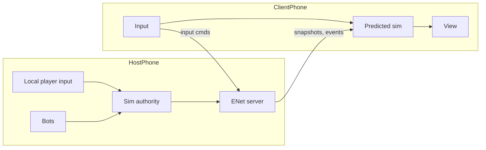

Host is also a player. **Host migration is out of scope for v1** (host leaves ⇒ match ends gracefully with results saved locally). Disconnect/reconnect: client may rejoin within 30 s and reclaim its slot.

## 23. AI / bot architecture

`BotBrain` outputs the same input struct a human produces → bots exercise the real sim. Layers: perception (view cone + LOS + hearing), utility scoring over goals (fight, loot, heal, retreat, objective, flank), navigation graph auto-built from `TileGrid` (walk edges + jetpack edges), tactical modules (reload behind cover, melee when out of ammo, grenade use, skill/pet use). Fairness: no wall-hacks, reaction delay and aim error from difficulty profile.

| Level | Reaction | Aim error | Skill use | Jetpack use |
|---|---|---|---|---|
| Easy | 600 ms | high | rare | minimal |
| Normal | 400 ms | medium | sometimes | moderate |
| Hard | 250 ms | low | often | tactical |
| Elite | 150 ms | very low | optimal | advanced |

Bots run host-side with no network cost; used for training, offline, and stress simulation.

## 24. UI architecture

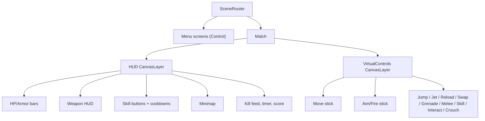

One global `Theme` resource generated from the tokens below; no per-screen style overrides. Menu input and gameplay input are separate routers (`InputRouter` mode switch). Landscape only.

### Color system

| Token | Hex | Use |
|---|---|---|
| bg_deep | `#101A16` | app background |
| bg_panel | `#1B2A22` | panels, cards |
| bg_raised | `#26382E` | buttons idle, tabs |
| primary | `#E8A33D` | main CTA, title, selection |
| primary_dark | `#B9791C` | pressed |
| secondary | `#7FB069` | positive secondary actions |
| accent | `#4FD1C5` | highlights, skill ready |
| text | `#F2F4EE` | main text |
| text_dim | `#9FB0A4` | secondary text |
| success | `#5BD66F` | health up, ready |
| warning | `#FFC247` | low ammo, cooldown near end |
| damage | `#FF5A4F` | damage numbers, low HP |
| armor | `#7FA8D6` | armor bar |
| fuel | `#FF9A3C` | jetpack bar |
| team_a / team_b / team_c / team_d | `#4FA3FF` / `#FF5A4F` / `#5BD66F` / `#B36BFF` | teams (also shape-coded for color-blind) |
| skill: combat/mobility/defense/support/tactical | `#FF7A59`/`#4FD1C5`/`#7FA8D6`/`#8BE28B`/`#C79BFF` | skill icons |
| rarity | see §11 | pickups, cards |

Color-blind rule: never color alone — team markers also use shape (circle/triangle/square/diamond); damage numbers have outline.

### Typography system (logical px at 1920×1080 base; ≈0.074 mm/px on a 6.5″ phone)

| Role | Size | Notes |
|---|---|---|
| Main title | 96 | boot/menu logo text |
| Menu title | 64 | screen headers |
| Section heading | 44 | panel titles |
| Body | 32 | descriptions |
| Button | 36 | caps, bold |
| HUD numbers | 40 | ammo, timer, score |
| HUD labels | 28 | **absolute minimum readable size** |
| Touch target min | 104 px (≈48 dp); gameplay buttons 120–160 px | spacing ≥ 16 px |

Font: Godot default until an OFL font (e.g. Rajdhani/Oxanium, SIL OFL) is committed with its license (ASSET_SOURCES).

### UI component rules

| Component | Rule |
|---|---|
| Button | radius 16, height ≥ 104, bg_raised idle / primary pressed, 150 ms press scale 0.96, always click SFX |
| Card | bg_panel, radius 20, 2 px rarity/accent border, 24 px padding |
| Tab | pill shape, selected = primary underline 6 px |
| Panel | bg_panel @ 92% opacity, 24 px margins, safe-area aware (notches) |
| Health bar | 360×28 px, green→yellow→red at 60/30%, numeric value |
| Armor bar | overlay under HP, `armor` color, shows plates count |
| Skill indicator | circular 140 px button, accent ring = ready, radial sweep cooldown, number seconds |
| Weapon HUD | icon + `mag/reserve`, reload ring, rarity border |
| Mini-map | 280×160 px top-right, 40% opacity, allies shape-coded, enemies only if marked/visible |
| Player marker | shape + team color + name (≤ 12 chars) |
| Kill notification | top-center feed, max 4 lines, 3 s, killer → weapon icon → victim |
| Match timer / score | top-center, 40 px, team scores colored |
| Lobby UI | slot list (40 rows scrollable, 2 columns landscape), host IP chip, ready toggles |

## 25. Audio architecture

Buses: `Master → Music, SFX, Voice, UI`. `AudioManager` autoload: pooled `AudioStreamPlayer`/`2D` (max 24 concurrent SFX, priority-based stealing), music director with crossfade and states (menu, lobby, match, low-HP intensity, victory, defeat, training). All assets generated by `tools/gen_audio.py` (D7): synth recipes (noise bursts, FM, filtered saw/square) for every SFX in the prompt's list; music = short seamless loops by seeded algorithmic composition. Output WAV 22.05 kHz mono, imported with ADPCM/loop flags. **Human listening review required** before release (R4).

## 26. Save / progression architecture

| File | Content | Safety |
|---|---|---|
| `user://settings.cfg` | audio, graphics, aim | ConfigFile, values validated/clamped, defaults on error |
| `user://controls.json` (schema 1) | HUD layout (15 controls: x, y, size, opacity, visibility), layout preset, haptics (master + per-control) | same atomic/SHA-256/.bak scheme, repaired on load by `HudLayout.sanitize` / `HapticConfig.sanitize` |
| `user://profile.json` (schema 2) | loadout (character, active, 4 passives, pet, weapons, melee, throwable, start armor), up to 6 custom presets, XP, unlocks, stats. **No HP/EP/armor numbers** | atomic write (tmp → rename), `.bak` rotation, SHA-256 integrity hash over the body string (corruption/tamper detection, not anti-cheat; GDScript has no built-in CRC32), `schema` version + migration functions |

Recovery: bad primary → load `.bak` → else defaults + notice. Never overwrite a save with a failed migration. Progression: XP per match; level curve `XP(n) = 100·n^1.5`:

| Level | 1 | 2 | 3 | 4 | 5 | 6 | 7 | 8 | 9 | 10 |
|---|---|---|---|---|---|---|---|---|---|---|
| XP to reach | 100 | 283 | 520 | 800 | 1118 | 1470 | 1852 | 2263 | 2700 | 3162 |

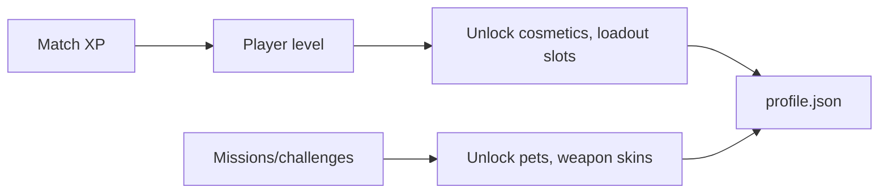

No pay-to-win; no IAP in v1; no required account; no analytics in v1.

## 27. Settings architecture

Sections: Audio (music, SFX, voice), Graphics (quality Low/Med/High, FPS 30/60/90, battery mode), Controls (aim sensitivity, aim mode, **Customize HUD** editor), **Haptics** (master + per-control, own screen), Language (string table `data/strings_<lang>.json`, default `en`; no hard-coded UI strings in gameplay code), About (version: game, build, git sha, engine). Settings apply live and persist.

## 28. Performance architecture

| Profile | Target device (indicative) | FPS | Particles | Draw-call budget | Notes |
|---|---|---|---|---|---|
| Low | ≈3 GB RAM, Mali-G52/Adreno 610 class | 30 stable | ≤ 150 | ≤ 120 | no parallax layers 3+, simple shadows off, 30 Hz view update for far entities |
| Mid | ≈4–6 GB, Adreno 618/Mali-G76 | 60 | ≤ 400 | ≤ 200 | |
| High | flagship | 60–90 | ≤ 800 | ≤ 300 | |

These are **targets**, not claims; measured results go to `PROJECT.md` and `TEST_PLAN.md`. Techniques: object pools (projectiles, particles, pickups, floating text), culling by camera rect, tile chunking, texture atlases from SVG parts rasterized at import size, ETC2/ASTC textures, audio streamed vs. preloaded split, no per-frame allocations in sim loops, 40-actor sim budget ≤ 6 ms/tick on Mid. APK size target ≤ 80 MB (unmeasured).

## 29. Testing architecture

Layers: (1) `validate_repo.py` static data/doc/secret checks; (2) headless GDScript unit tests (sim math, damage, modifiers, inventory, save/migration, protocol encode/decode, snapshot delta); (3) deterministic scenario tests (scripted inputs → expected states, bot-vs-bot soak); (4) `sim_stress.gd`: N simulated clients on loopback → **SIMULATED 40 PLAYER TEST**; (5) on-device manual/instrumented tests; (6) **REAL 40 DEVICE PLAYER TEST** only when 40 devices participate. Details in `TEST_PLAN.md`.

## 30. CI/CD architecture

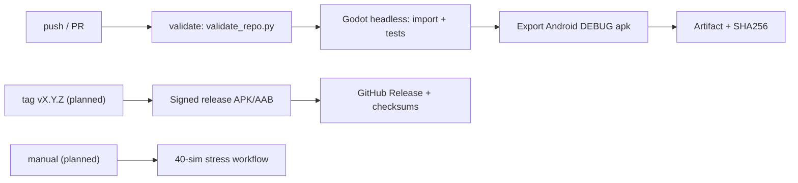

Pinned: Godot 4.6.3, JDK 17 (Temurin), Android SDK platform 35, build-tools 35.0.1, NDK 28.1.13356709, CMake 3.10.2.4988404, Ubuntu 24.04 runner. Godot downloads verified against the release `SHA512-SUMS.txt`. Secrets only in GitHub Secrets. All workflows are phone-triggerable (`workflow_dispatch`).

## 31. Release architecture

Versioning `MAJOR.MINOR.PATCH` (game) + monotonic `build_number` (CI run number) + short git SHA + Godot version; Android `version/code` = build number, `version/name` = game version; shown in About. Release secrets (names only): `ANDROID_KEYSTORE_BASE64`, `ANDROID_KEYSTORE_USER`, `ANDROID_KEYSTORE_PASSWORD`. Debug builds are always labelled DEBUG and never called release. Pre-release checklist: store/legal quick check (name/icon trademark, engine MIT notice, SDK licenses, ratings, loot-rarity disclosure not applicable offline), soak test, fresh install + upgrade-over-previous test, checksum published.

## 32. Android architecture

arm64-v8a, min SDK per Godot 4.6 default, target SDK per Godot 4.6 template (re-check Play requirements before store release). Permissions: INTERNET, ACCESS_NETWORK_STATE, ACCESS_WIFI_STATE, CHANGE_WIFI_MULTICAST_STATE, VIBRATE. Immersive landscape (sensor), keep-screen-on during matches. Lifecycle: on pause → pause single-player sim; in multiplayer show "backgrounded" and keep ENet alive ≤ 30 s, then drop. Low-memory callback → shrink pools. Touch: multi-touch tracked per `index`; sticks capture their own finger; safe-area insets honored. A small Kotlin Android plugin for `MulticastLock` is a possible later need (requires Gradle build template) — only if discovery tests demand it.

## 33. Desktop expansion architecture (after Android release gate)

Same codebase. Add export presets Windows/Linux/macOS, input map for keyboard+mouse+gamepad (`InputRouter` desktop profile), resolution/window settings, higher quality tier, platform packaging in CI (macOS unsigned unless signing assets provided). Gate: Android V1 acceptance (PROJECT.md) fully verified. Desktop must not alter Android code paths without Android regression run.

## 34. Game modes

| Mode | Teams | Win condition | Respawn |
|---|---|---|---|
| Team Deathmatch | 2+ | kill target or time | yes |
| Free-for-All | none | kill target or time | yes |
| Control | 2 | zone-time points | yes |
| Survival | co-op | survive waves | no (revive by ally) |
| Training | solo | none | yes |

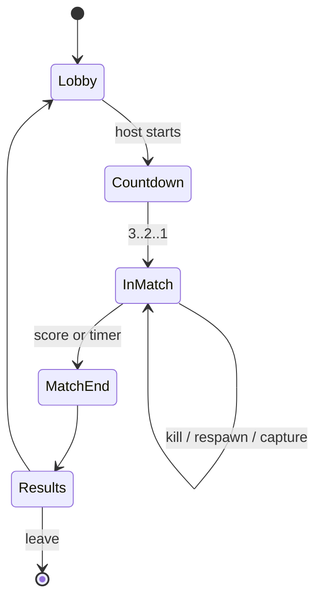

## 35. Feature matrix (Android V1 vs later)

| Feature | V1 | Later |
|---|---|---|
| Move/jump/jetpack/crouch | ✔ | slide polish |
| Guns/reload/swap | ✔ 12 weapons | skins, mastery |
| Melee | ✔ | dash attack, counters, finishers |
| Grenades | ✔ 7 | — |
| Armor/health/loot/backpack | ✔ | air drops |
| Characters/skills/pets | ✔ ≥2 (target 4) | more roster |
| Maps | ✔ 2 → 5 | map hazards, destructibles |
| LAN host/join + manual IP | ✔ | host migration research |
| Bots (4 levels) | ✔ | — |
| Modes | TDM, FFA, Training first; Control, Survival after | extras |
| Save/settings | ✔ | cloud save (needs backend) |
| Desktop | — | ✔ |

## 36. Extra features (evaluated, not committed)

Kill streaks (cheap, fun — X1), assists (needed for score — X2), daily missions (offline, cheap — X3), match statistics (X4), air drops (needs net events — X5, M2), moving platforms (map complexity — later), spectator (net cost — later), replay (high cost — later). Only X1–X4 enter V1 scope after core loop is verified.

## 37. Future expansion

Ranked/custom rooms architecture, internet play via relay (server-authoritative dedicated host), more maps/modes through data, cosmetics, host migration. Each requires a blueprint update before work.

## 38. Phase map

| Phase | Output | Gate |
|---|---|---|
| 0 | Docs + scaffold + CI | docs validated, workflow runs |
| 1 | Foundation: scenes, state, input, audio, save, UI, CI export | debug APK installs and boots on phone |
| 2 | Core player | movement/jetpack/shoot/melee playable offline |
| 3 | Combat | weapons, grenades, loot, backpack |
| 4 | Characters/skills/pets | 2+ characters complete |
| 5 | Maps | 2 playable maps, validated |
| 6 | LAN multiplayer | 2–4 real devices network-verified |
| 7 | Bots/training | bots pass soak |
| 8 | UI/UX/audio/polish | full menus + HUD |
| 9 | Perf/QA | measured on low/mid/high devices; 40 sim |
| 10 | Android release | signed, installed, checksummed |

## 39. EP / energy system
See `docs/combat.md`. Max 100 (+25 Capacitor Bank, cap +50); active skills and pet abilities cost EP; regen 6 EP/s after 2.5 s without spending; EP Cell +50; only Energy Mender converts EP to HP (2 EP per HP); Energy Barrier spends EP to absorb 20% of damage (1:1). EP is never shown or treated as an HP bar.

## 40. Loadout, presets, validation
See `docs/loadout.md`. Slots: character, active, 4 passives, pet, primary, secondary, melee, grenade/utility, start helmet/vest (max L1). Validator codes E_*; 4 built-in + up to 6 custom presets; invalid builds are never saved; profile schema 2 with v1 migration.

## 41. HUD customization and haptics
See `docs/controls_haptics.md`. 15 controls, per-control position/size/opacity/visibility with screen/inset/top-strip clamping, required controls cannot be hidden, layout presets, test mode; master + per-control haptics (preset/strength/length) persisted in `controls.json`; Android amplitude limitation documented and surfaced in the UI.

## 42. Multiplayer validation of customization
See `docs/multiplayer_validation.md`. Client sends ids only; host whitelists, validates with the same rules and derives every number from `balance.json`. Transport-level checks arrive in Phase 6.

## 44. Phase 2 slice: movement + Training Range
`data/movement.json` (px units): gravity 2200, walk 360, jump 760 (about 125 px high), air speed 380, crouch half speed and a 60 px box (needs headroom to stand), jetpack thrust 3400 up to 520 px/s rise, 100 fuel at 40/s, refuel 25/s on ground and 6/s in air, 1.5 s lockout when empty. Tile map `data/maps/training.json` ('#' solid, '=' one-way, 'S' spawn, 'D' dummy). Touch controls are built from the saved HUD layout (`src/ui/touch_controls.gd`, multi-touch, sticks fixed at their widgets). Weapons in the range are simplified hitscan with ammo/reload; hits go through the real DamagePipeline. See docs/art_pipeline.md for the character.

## 43. Combat Lab
A menu screen (not a game mode) where the player is a test dummy running the real damage pipeline, EP, items and skills with their loadout, so rules can be verified on a phone before the match simulation exists.
